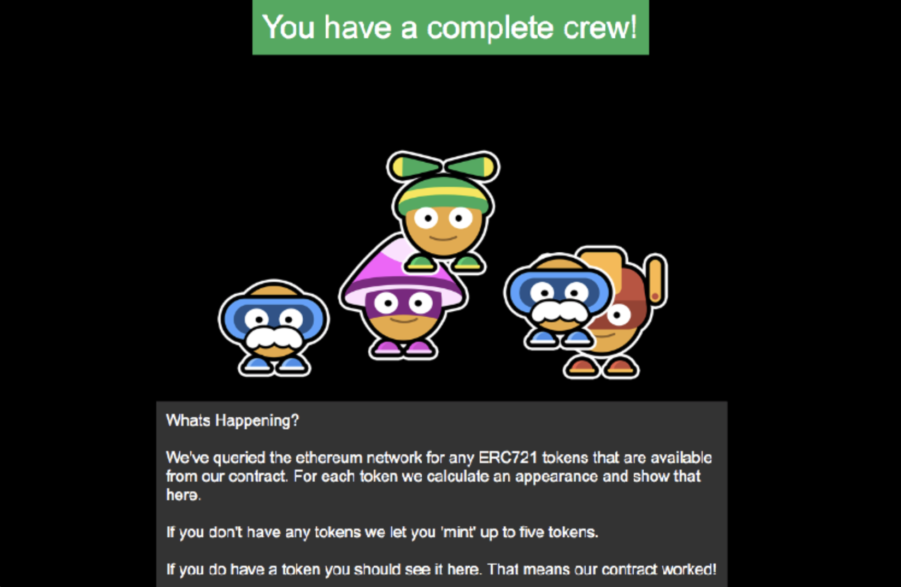

# Examples

These examples are a great way to quickly dive in and see how you can integrate Bitski into an app on the platforms we support. Both of these examples use the same contract and assets to demonstrate how you can use Bitski to build cross-platform apps.

## Buying NFTs with credit cards with App Wallet

[Visit our demo here](https://stripe-demo.bitski.com) [View the code](https://github.com/BitskiCo/example-stripe-nft)

## Simple web app

[Visit our demo here](https://example-dapp-1.bitski.com) [View the code](https://github.com/BitskiCo/example-dapp-game)

## iOS app

Our demo app is not available on the App Store yet, but you can still easily run it yourself from Xcode.

[View the code](https://github.com/BitskiCo/example-native-dapp)

